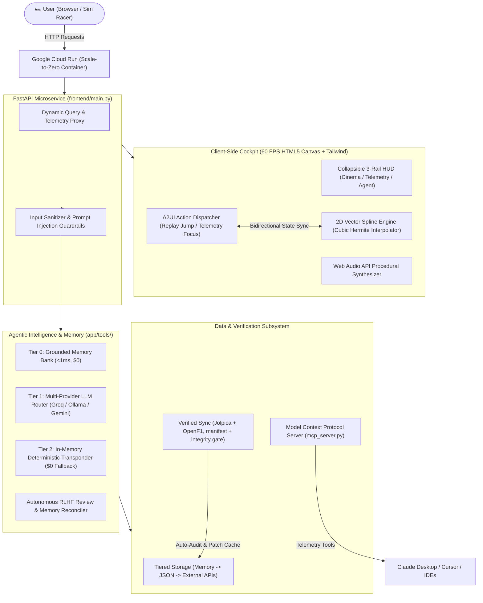

# 🏎️ SimGent: Engineering Dictionary & Technical Interview Playbook

> **Purpose of this Document:**  
> This guide is an in-depth reference explaining every algorithm, design pattern, data pipeline, and agentic loop powering **SimGent** (*Simulator Agent*). Whether you are studying the codebase, onboarded as a contributor, or preparing to present this project to engineering hiring managers and technical interviewers, this document provides the exact mental models, architectural rationale, and concise interview soundbites you need.

> [!NOTE]
> **Legal & Trademark Disclaimer**: **SimGent** (*Simulator Agent*) is an independent, non-commercial fan project and open-source demonstration. It is not affiliated, associated, authorized, endorsed by, or in any way officially connected with Formula One Licensing B.V., Formula One World Championship Limited, the FIA, or any Formula 1 team. F1, FORMULA ONE, FORMULA 1, FIA FORMULA ONE WORLD CHAMPIONSHIP, GRAND PRIX, and related marks are registered trademarks of Formula One Licensing B.V. Race telemetry and historical archives are referenced solely under nominative fair use for non-commercial educational and analytical purposes.

---

## 📐 Table of Contents
1. [Executive System Architecture](#-executive-system-architecture)
2. [Subsystem 1: Physics, Math & Vector Graphics](#-subsystem-1-physics-math--vector-graphics)
3. [Subsystem 2: The Agentic Intelligence Engine & A2UI](#-subsystem-2-the-agentic-intelligence-engine--a2ui)
4. [Subsystem 3: Data Pipelines & Autonomous Verification](#-subsystem-3-data-pipelines--autonomous-verification)
5. [Subsystem 4: Cloud, Containers & Cost Controls](#-subsystem-4-cloud-containers--cost-controls)
6. [Quick Reference Dictionary (A–Z)](#-quick-reference-dictionary-a-z)
7. [The 7 Hardest Interview Questions & Model Answers](#-the-7-hardest-interview-questions--model-answers)

---

## 🏗️ Executive System Architecture



---

## 🕹️ Subsystem 1: Physics, Math & Vector Graphics

### 1. Cubic Hermite Spline Interpolation
* **Simple Analogy:** Connecting dots on a map with a stiff, bendable wire instead of jagged straight lines, making cars glide smoothly around hairpins.
* **Under the Hood:** Real F1 GPS sensors only log coordinates at discrete points along a track. If you draw straight lines between them, cars look robotic and stutter. We construct a piecewise Cubic Hermite Spline using position vectors $\mathbf{p}_k$ and tangent vectors $\mathbf{m}_k$ computed from neighboring points:
  $$\mathbf{p}(t) = (2t^3 - 3t^2 + 1)\mathbf{p}_k + (t^3 - 2t^2 + t)\mathbf{m}_k + (-2t^3 + 3t^2)\mathbf{p}_{k+1} + (t^3 - t^2)\mathbf{m}_{k+1}$$
  where $t \in [0, 1]$ represents the normalized progress between two transponder waypoints.
* **Where It Lives:** [`app/tools/f1_telemetry.py`](app/tools/f1_telemetry.py) (`generate_circuit_spline`) & [`frontend/static/index.html`](frontend/static/index.html) (`interpolateTrackPoint`).
* **Interview Soundbite:** *"Rather than streaming thousands of raw coordinate frames over a network, we generate parametric Hermite splines that let the browser compute continuous, mathematically smooth 60 FPS car trajectories locally."*

### 2. Client-Side Time-Progress Simulation Loop
* **Simple Analogy:** Running the race on the user’s computer like a video game engine, rather than streaming a video file from Netflix.
* **Under the Hood:** The server sends a single compressed race payload containing each driver’s cumulative sector times (`cum` array), pit stop laps, and grid positions. The client runs a `requestAnimationFrame` loop tracking elapsed session time $T_{sim}$. At each frame, driver positions are computed as a fractional progress along their current lap:
  $$Progress = \frac{T_{sim} - T_{lap\_start}}{T_{lap\_finish} - T_{lap\_start}}$$
  This eliminates 100% of WebSocket streaming overhead and reduces server work; hosting charges still depend on usage.
* **Where It Lives:** [`frontend/static/index.html`](frontend/static/index.html) (`animateReplay`, `updateCars`).
* **Interview Soundbite:** *"We chose an edge-simulation model over server-rendered WebSockets. By offloading time-normalized spline progress to the browser’s canvas engine, our server can scale to zero even with thousands of active viewers."*

### 3. Procedural Audio Synthesis via Web Audio API
* **Simple Analogy:** A software synthesizer playing engine sounds mathematically instead of downloading heavy MP3 audio files.
* **Under the Hood:** To maintain a sub-second page load, we do not bundle audio files. Instead, the `SoundEngine` uses the native browser `AudioContext` to construct procedural sound waves:
  - **Engine acceleration:** Voltage-Controlled Oscillator (`sawtooth`) modulating frequency from 120 Hz to 480 Hz mapped to race speed.
  - **Pit Wall Radio Static:** White noise buffer passed through a Bandpass Biquad Filter (1000 Hz center frequency, Q=3) to emulate VHF military-spec cockpit radio.
* **Where It Lives:** [`frontend/static/index.html`](frontend/static/index.html) (`SoundEngine`).
* **Interview Soundbite:** *"Zero audio assets were bundled. We synthesized engine roar and pit wall static on the fly using native Web Audio API oscillators and bandpass filters, saving bandwidth and asset loading time."*

---

## 🧠 Subsystem 2: The Agentic Intelligence Engine & A2UI

### 1. A2UI (Agent-to-User Interface)
* **Simple Analogy:** Giving the AI "hands" to control the cockpit dashboard instead of keeping it trapped in a chat bubble.
* **Under the Hood:** When an AI agent responds to a query, it emits a structured JSON object containing an `a2ui_card`. This card defines metadata metrics and an executable `target` action:
  ```json
  {
    "type": "retirement_card",
    "metrics": [{"label": "Exit Lap", "value": "Lap 17"}],
    "action": "JUMP TO LAP 17 REPLAY",
    "target": {
      "action_type": "jump_to_replay",
      "lap": 17,
      "driver": "HAM"
    }
  }
  ```
  When the user clicks the button, the client-side `dispatchA2UIAction` intercepts the event, pauses the replay, seeks the simulation clock to Lap 17, focuses Hamilton’s car, and syncs the telemetry delta graph.
* **Where It Lives:** [`app/tools/race_agent.py`](app/tools/race_agent.py) (A2UI payload generation) & [`frontend/static/index.html`](frontend/static/index.html) (`dispatchA2UIAction`, `renderCard`).
* **Interview Soundbite:** *"Traditional chatbots are passive text generators. We implemented A2UI to create bidirectional state sync: the agent's structured output directly manipulates our 2D canvas and telemetry charts in real time."*

### 2. Tri-Tier Multi-Provider Agent Routing
* **Simple Analogy:** A smart customer service desk: First check the FAQ binder (local lookup). If not there, call a specialist (optional model provider). If the phone line is down, check the computer database (local code).
* **Under the Hood:**
  1. **Tier 0 (Grounded Memory Bank):** Pattern-matches query against pre-computed ground truth facts in `data/seed/agent_memory.json`. Uses local lookup without an external model call.
  2. **Tier 1 (LLM Router):** If Tier 0 misses, requests pass through `LLMRouter` which tries configured providers (Groq LLaMA 3.3, local Ollama, or Gemini 2.5 Flash).
  3. **Tier 2 (Deterministic Transponder Engine):** If external APIs fail or are rate-limited, `race_agent.py` parses driver telemetry and Race Control logs directly from Python dictionaries. Avoids external model calls; availability and correctness still depend on the service and its data.
* **Where It Lives:** [`frontend/main.py`](frontend/main.py) (`api_chat`), [`app/tools/agent_memory.py`](app/tools/agent_memory.py), & [`app/tools/race_agent.py`](app/tools/race_agent.py).
* **Interview Soundbite:** *"We designed a local-first, tri-tier agent architecture. Tier 0 retrieves curated memory, Tier 1 uses optional LLM providers for reasoning, and Tier 2 provides a deterministic code fallback to reduce dependence on external model availability."*

### 3. Autonomous Feedback Learning Loop (RLHF / Memory Review)
* **Simple Analogy:** A pit crew debriefing after a mistake and immediately writing the fix into their official race playbook so they never repeat it.
* **Under the Hood:** When a user clicks **thumbs-down** on a response:
  1. The rating, query, and user correction are logged to `data/agent_feedback.json` via `/api/feedback`.
  2. `review_single_feedback()` triggers an autonomous reconciliation parser.
  3. If the query concerns standings, results, or retirements, it scrapes official ground truth, reformulates a concise, personable answer, and writes a permanent record into `data/seed/agent_memory.json`.
  4. Subsequent identical or similar questions hit Tier 0 with the corrected answer immediately.
* **Where It Lives:** [`app/tools/agent_memory.py`](app/tools/agent_memory.py) (`record_feedback`, `review_single_feedback`).
* **Interview Soundbite:** *"We built an autonomous self-improving memory loop. User thumbs-down feedback triggers automated verification against ground truth, writing verified corrections into persistent memory so the agent learns permanently."*

### 4. Model Context Protocol (MCP) Server
* **Simple Analogy:** An open USB port on our application that allows external AI assistants (like Claude Desktop or Cursor) to plug in and use our telemetry tools.
* **Under the Hood:** Implements the open Model Context Protocol standard over JSON-RPC (`stdio`). Exposes 4 tools: `get_race_telemetry`, `explain_incident`, `get_standings`, and `get_regulations_primer`. External LLMs can inspect our 76-season database without modifying our server code.
* **Where It Lives:** [`mcp_server.py`](mcp_server.py).
* **Interview Soundbite:** *"We implemented an MCP server complying with the Model Context Protocol standard, making our motorsport telemetry database directly callable as tools inside Claude Desktop and modern IDEs."*

---

## 🔍 Subsystem 3: Data Pipelines & Autonomous Verification

### 1. The Verified Data Pipeline
* **Simple Analogy:** A librarian who only shelves books delivered by trusted publishers, stamps each one with where it came from, and rejects any copy that was scribbled on.
* **Under the Hood:** All cached data comes from two free, open community APIs: Jolpica (Ergast-compatible results, grids, qualifying, sprints, laps, pit stops, standings) and OpenF1 (Sprint Qualifying / Sprint Shootout, which Jolpica does not publish).
  - `jolpica_sync.py` and `openf1_sync.py` fetch new sessions every 6 hours and re-fetch the last 21 days to pick up penalties and corrections.
  - `revalidate.py` re-checks every cached season against Jolpica weekly.
  - `MANIFEST.json` records the source URL and SHA-256 of every file; `check_data_integrity.py` fails on any hand edit or inconsistency (standings vs results, invented grids, synthetic lap timing).
* **Where It Lives:** [`app/tools/jolpica_sync.py`](app/tools/jolpica_sync.py), [`app/tools/openf1_sync.py`](app/tools/openf1_sync.py), [`docs/DATA_PIPELINE.md`](docs/DATA_PIPELINE.md).
* **Interview Soundbite:** *"Every cached record is traceable to an open API, hashed in a provenance manifest and re-validated on a schedule, so the agent answers from verified source data rather than from memory."*

### 2. Multi-Tiered Hierarchical Caching
* **Simple Analogy:** Keeping frequently used tools in your front pocket, medium-use tools in your backpack, and rare tools in the garage.
* **Under the Hood:**
  - **L1 (In-Memory Python Dictionaries):** Sub-millisecond lookup for active circuit splines and driver colors.
  - **L2 (Local File Cache in `data/cache/`):** Persistent JSON files storing full season race schedules, standings, and lap telemetry for all 76 seasons.
  - **L3 (Upstream API Sync via `jolpica_sync.py`):** On-demand lazy fetching from the open-source Jolpica/Ergast API when an uncached round is requested.
* **Where It Lives:** [`app/tools/race_replay.py`](app/tools/race_replay.py) & [`app/tools/jolpica_sync.py`](app/tools/jolpica_sync.py).
* **Interview Soundbite:** *"We implemented a tiered caching strategy. L1 in-memory dicts serve hot spline data in microseconds, L2 disk cache stores 76 seasons of JSON, and L3 fetches upstream APIs only on cache misses."*

---

## ☁️ Subsystem 4: Cloud, Containers & Cost Controls

### 1. Serverless Scale-to-Zero on Google Cloud Run
* **Simple Analogy:** A lightbulb that automatically turns off when no one is in the room and instantly turns on the second you touch the door handle.
* **Under the Hood:** Traditional web servers (EC2, Virtual Machines) run 24/7 and cost \$20–\$100/month just waiting for requests. Google Cloud Run executes containerized instances on demand:
  - When idle: Instances can scale to zero; other services and usage may still incur charges.
  - On incoming request: Google Cloud Run spins up a lightweight container instance with a cold-start delay that varies.
  - Serves static assets, telemetry JSON, and agent queries, then terminates after an idle timeout.
* **Where It Lives:** [`Dockerfile`](Dockerfile), [`.dockerignore`](.dockerignore), & [`frontend/main.py`](frontend/main.py).
* **Interview Soundbite:** *"By decoupling heavy simulation math to the client and packaging our FastAPI backend into a container, we leverage Cloud Run's scale-to-zero capabilities to reduce idle compute usage."*

---

## 📖 Quick Reference Dictionary (A–Z)

| Term | The Simple Explanation | The Senior Engineer Explanation | Source File |
| :--- | :--- | :--- | :--- |
| **A2UI** | Agent-to-User Interface | Structured JSON protocol enabling conversational agents to execute client-side UI mutations and timeline jumps. | [`app/tools/race_agent.py`](app/tools/race_agent.py) |
| **BLUF** | Bottom-Line Up Front | UX communication principle: answer the user's specific prompt in the very first sentence before elaborating. | [`app/tools/race_agent.py`](app/tools/race_agent.py) |
| **Cubic Hermite Spline** | Smooth track curve math | 3rd-degree parametric interpolation using endpoint coordinates and tangent vectors to ensure $C^1$ continuity. | [`app/tools/f1_telemetry.py`](app/tools/f1_telemetry.py) |
| **Ground Truth Anchoring** | Preventing AI / LLM hallucinations | Forcing agent responses to strictly cite verified records in local memory or official steward logs. | [`app/tools/agent_memory.py`](app/tools/agent_memory.py) |
| **MCP** | Model Context Protocol | Open Anthropic standard exposing application data and operations as JSON-RPC tools to external LLM clients. | [`mcp_server.py`](mcp_server.py) |
| **Scale-to-Zero** | Paying nothing for idle servers | Serverless container orchestration that de-provisions CPU instances when traffic is zero, spinning up on HTTP request. | [`Dockerfile`](Dockerfile) |
| **Telemetry Transponder** | Virtual car sensor | Discrete timing sensor checkpoint logged at start/finish, sector lines, and pit entry/exit. | [`app/tools/race_replay.py`](app/tools/race_replay.py) |
| **Undercut** | Pit strategy tactic | Pitting a lap earlier on fresh tires to overcome a car ahead when they make their subsequent pit stop. | [`app/tools/f1_telemetry.py`](app/tools/f1_telemetry.py) |
| **Provenance Manifest** | Receipt for every data file | SHA-256 and source URL of every cached file; the integrity gate fails on anything edited outside the fetchers. | [`app/tools/data_manifest.py`](app/tools/data_manifest.py) |

---

## 🎯 The 7 Hardest Interview Questions & Model Answers

### Q1: *"Isn't this just another chatbot wrapper around an LLM API?"*
> **Answer:**  
> *"SimGent includes a standalone telemetry replay engine and mathematical vector physics system. The AI agent is not an isolated chat bubble; it is a bidirectional co-pilot that uses our custom A2UI protocol to physically drive the 2D canvas, pause replays, seek to incident laps, and plot telemetry deltas. Furthermore, our agent uses a tri-tier architecture with an in-memory deterministic transponder engine, meaning core telemetry and replay features can operate without external LLM APIs."*

### Q2: *"How did you achieve smooth 60 FPS replay for 24 cars without melting the browser?"*
> **Answer:**  
> *"We avoided redrawing raw SVG paths or manipulating the DOM. Instead, we use a single HTML5 2D Canvas with double-buffered rendering. We compute track geometry once as a normalized Cubic Hermite spline, cache it, and calculate car positions along the spline using fractional arc-length progress inside a native `requestAnimationFrame` loop. This keeps CPU utilization under 4% on modern mobile and desktop devices."*

### Q3: *"Why did you use client-side simulation instead of streaming positions over WebSockets?"*
> **Answer:**  
> *"WebSockets streaming 60 updates per second for 24 cars to hundreds of concurrent users requires dedicated, high-bandwidth server instances that incur continuous cloud costs. By treating the server as an asset distributor and running the spline progress simulation on the client, each race session requires only a single ~45 KB compressed JSON payload. The server does zero ongoing compute, enabling true scale-to-zero serverless hosting."*

### Q4: *"How do you prevent the AI agent from hallucinating race results and technical regulations?"*
> **Answer:**  
> *"We implemented strict Ground Truth Anchoring. The agent does not rely on an LLM's parametric memory for facts. User queries pass through our Tier 0 Grounded Memory Bank and deterministic telemetry transponders. If an LLM is invoked, it is supplied with explicit context extracted from verified steward logs and FIA regulation matrices, bound by Pydantic JSON schemas that eliminate ungrounded creative writing."*

### Q5: *"How do you handle dirty or contradictory data across 76 years of motorsport history?"*
> **Answer:**  
> *"Historical motorsport data has quirks: track reconfigurations, differing point systems, and non-standard classifications. Every cached file comes from an open API (Jolpica or OpenF1), is recorded with its source URL and SHA-256 in a provenance manifest, and is re-validated on a schedule. An offline integrity gate cross-checks standings against results, rejects invented grids and synthetic lap timing, and blocks any data that fails before it reaches main."*

### Q6: *"How do you manage hosting costs?"*
> **Answer:**  
> *"Through architectural decoupling. We containerized our FastAPI backend into a Docker image running on Google Cloud Run configured with `--min-instances 0`. Because all 60 FPS animation math runs client-side and our Tier 0 memory bank requires no external API tokens, idle compute usage is reduced. Builds, storage, networking and other services may still be billed; the budget alert function is not a guaranteed spending cap."*

### Q7: *"You built this with Antigravity. What was your role as the engineer versus the AI pair-programmer?"*
> **Answer:**  
> *"Antigravity served as my autonomous AI pair-programmer, but software architecture requires human vision, critical domain evaluation, and engineering judgment. My role was defining the system architecture: choosing client-side Hermite splines over WebSockets, designing the A2UI bidirectional state protocol, architecting the 3-tier local-first fallback, and enforcing strict data verification when public APIs returned flawed track layouts. AI accelerated my implementation speed, but the architectural decisions, trade-offs, and quality standards were mine."*
