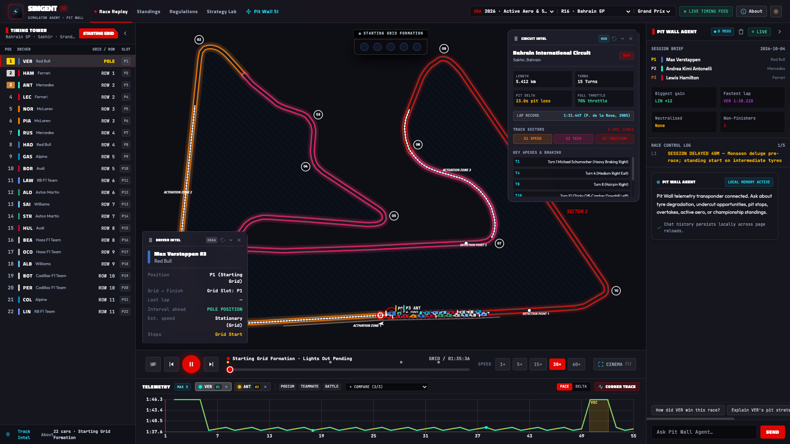
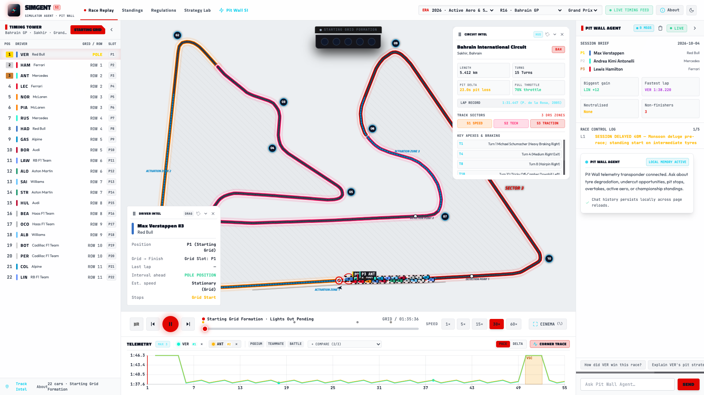
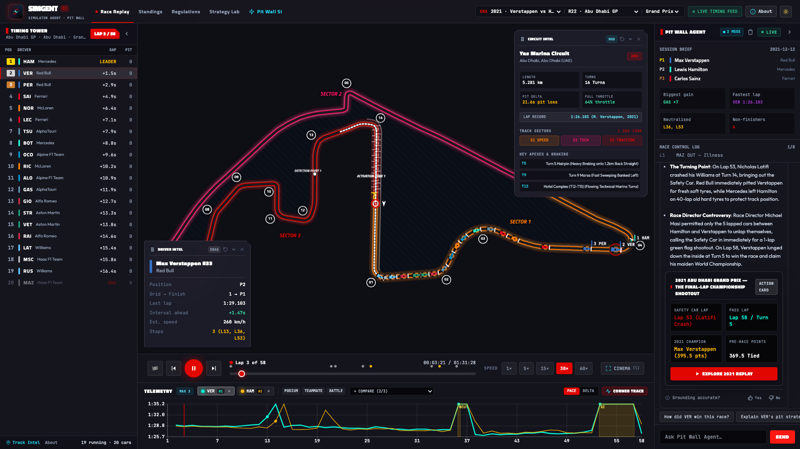
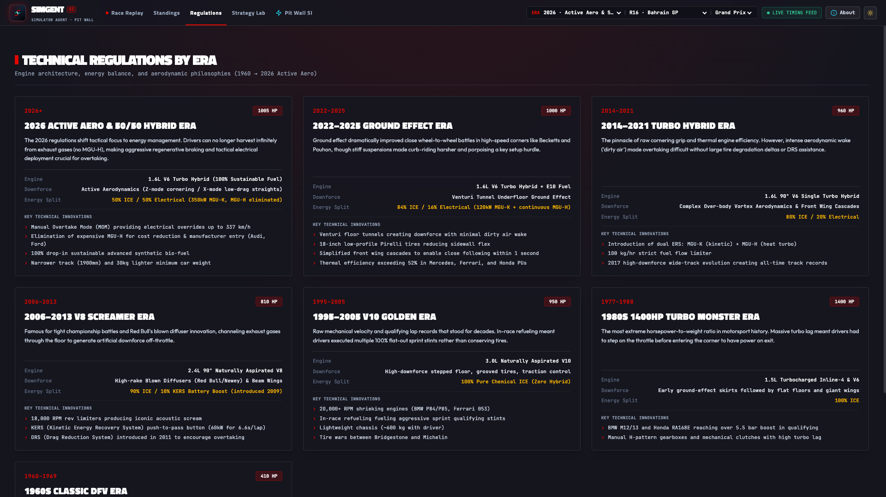
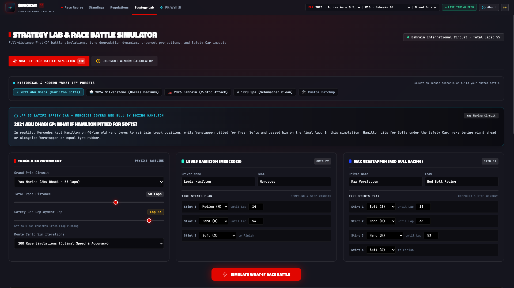
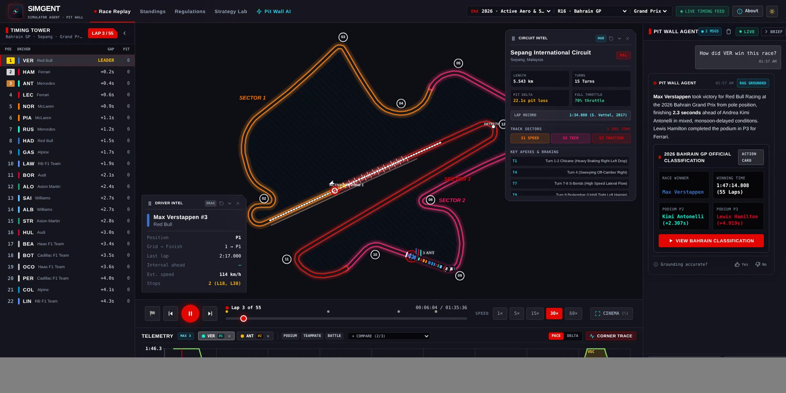
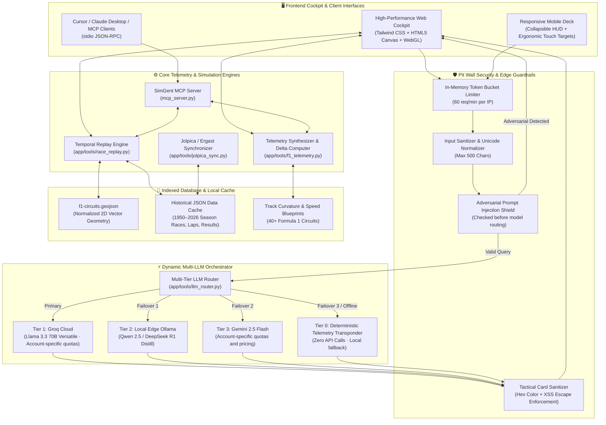
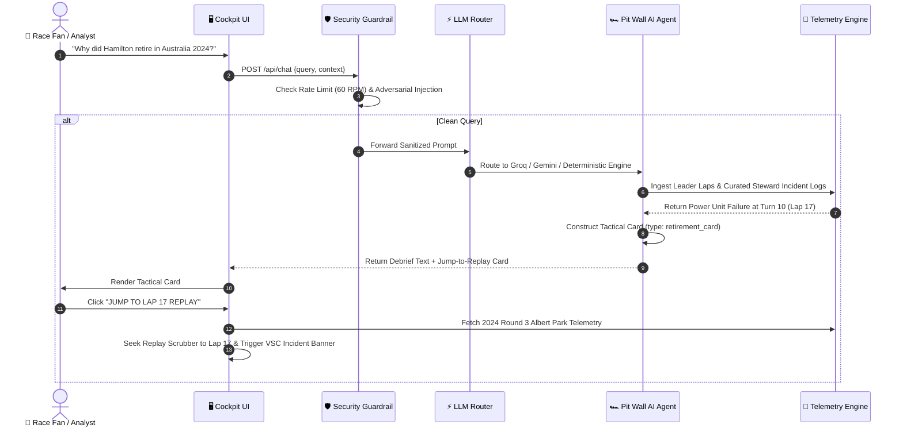

<p align="center">
  
</p>

<h1 align="center">🏎️ SimGent — Simulator Agent: Autonomous AI Pit Wall & Telemetry Cockpit</h1>

<p align="center">
  <strong>Independent Open-Source Motorsport Telemetry Cockpit, 2D Vector Replay Player, & Autonomous AI Race Engineer (1950–2026)</strong>
</p>

<p align="center">
  <a href="https://simgent.tonyyang.work"></a>
  <a href="DICTIONARY.md"></a>
  <a href="tests/README.md"></a>
  <a href=".github/workflows/ci.yml"></a>
  <a href="LICENSE"></a>
  <a href="https://www.python.org/"></a>
  <a href="https://fastapi.tiangolo.com"></a>
  <a href="https://modelcontextprotocol.io"></a>
  <a href="https://cloud.google.com/run"></a>
  <a href="#-security--governance-architecture"></a>
</p>

> **Experience the Live Application:** 👉 **[https://simgent.tonyyang.work](https://simgent.tonyyang.work)**
> 📖 **Engineering Deep-Dive & Interview Playbook:** 👉 **[`DICTIONARY.md`](DICTIONARY.md)**

> [!IMPORTANT]
> **Legal Notice & Trademark Disclaimer (Nominative Fair Use)**:
> **SimGent** (*Simulator Agent*) is an independent, non-commercial open-source research and educational demonstration project developed by fans. **SimGent is not affiliated, associated, authorized, endorsed by, or in any way officially connected with Formula One Licensing B.V., Formula One World Championship Limited, the FIA (Fédération Internationale de l'Automobile), Formula One Management (FOM), or any Formula 1 constructor, team, or driver.**
>
> All trademarks, service marks, trade names, and team identities referenced within this repository and application (including but not limited to *F1*, *FORMULA ONE*, *FORMULA 1*, *FIA FORMULA ONE WORLD CHAMPIONSHIP*, team marks, and circuit names) are the property of their respective owners. They are used only to refer to the real teams, drivers, events and circuits, for historical identification, technical analysis and education. No commercial relationship, sponsorship, license, or endorsement is expressed or implied.

---

## 👨‍👦 Built for the Love of Racing: A Father & Kids Project

Every race weekend, my kids and I sit together watching the Grand Prix. Between safety car restarts, undercut attempts, and telemetry deltas, they would constantly ask:
- *"Dad, why did Ferrari box so early?"*
- *"Is Norris actually catching Verstappen, or is he saving his tyres?"*
- *"What happened to Hamilton's engine on Lap 17?"*

Commercial timing screens are locked behind paywalls or designed like 1990s spreadsheets that kids can't explore. I wanted to build something intuitive and inspiring for them: a 60 FPS interactive 2D replay cockpit paired with an autonomous AI Race Engineer they could talk to in plain English.

What started as a family race-day side project became **SimGent** (short for **Simulator Agent**) — an open-source pit wall telemetry cockpit covering 76+ years of Grand Prix racing history (1950–2026).

---

## 📸 Application Showcase

### 1. High-Performance 2D Vector Replay Cockpit (Dark Mode)
*Unobstructed racing line view across 40+ Grand Prix circuits, 20+ synchronized car models in team-inspired colors, live timing tower, multi-driver telemetry curves, and real-time session debriefs.*



### 2. Daytime Light Mode Cockpit
*High-contrast day theme engineered for daylight readability with full SVG vector sharpness and collapsible telemetry HUDs.*



### 3. Autonomous AI Pit Wall & Interactive A2UI Action Cards
*Natural language race engineer answering tactical, strategy, and incident queries. The AI emits interactive A2UI action cards (`[EXPLORE 2021 REPLAY]`) that directly scrub the replay camera and telemetry timeline to the exact lap and corner of the incident.*



### 4. Technical Regulations & Power Unit Era Matrix (1950–2026)
*In-depth technical comparison of engine architectures, electrical deployment splits, active aerodynamics (X/Z-mode), and chassis regulations across 75+ years of Grand Prix racing history.*



### 5. Strategy Lab & Monte Carlo "What-If" Battle Simulator
*Full-distance tactical race battle simulations between any two driver strategies. Features non-linear tire degradation curves, fuel burn-off dynamics, and a 200-iteration Monte Carlo engine with stochastic win probabilities.*



[](https://github.com/YangKuoshih/SimgentF1/raw/main/docs/assets/simgent-demo.mp4)

> 🎥 **Demo (about 40 seconds):** [Watch the screen recording (MP4)](docs/assets/simgent-demo.mp4), or see it on [tonyyang.work](https://tonyyang.work).

---

## ✨ Key Features & Capabilities

### 1. Interactive 2D Vector Circuit Replay
- Full normalized vector track maps rendered from real geospatial circuit coordinates (`f1-circuits.geojson`).
- Dynamic heading rotation \(\theta = \arctan2(\Delta y, \Delta x)\) synchronizing micro-car models with team-inspired colors (Ferrari `#E80020`, Red Bull `#3671C6`, McLaren `#FF8000`, Mercedes `#27F4D2`, Aston Martin `#229971`, etc.).
- Real-time **Race Control event transponders**: Safety Car (SC), Virtual Safety Car (VSC), Red Flags, Yellow Flags, and non-finisher (DNF) markers.
- Fully collapsible, movable HUDs: minimizes the Driver Telemetry Card and Circuit Intel HUD for an unobstructed view of the racing line.

### 2. Autonomous AI Pit Wall Radio
- Ask any natural language question about pit stop tactics, tire degradation, regulations, or historical retirements.
- Dynamic multi-LLM orchestrator (Groq Llama-3.3-70B, Google Gemini 2.5 Flash, Ollama, and local deterministic transponder fallback).
- **Tactical Action Cards**: The agent doesn't just return text; it synthesizes interactive action cards (e.g. `[JUMP TO LAP 17 REPLAY]`) that scrub the entire cockpit camera and telemetry timeline directly to the incident.

### 3. Multi-Driver Telemetry Delta Cockpit
- High-fidelity telemetry comparisons across any drivers on the grid.
- Synchronized overlays for **Speed (km/h)**, **Throttle (%)**, **Braking Pressure (%)**, **Gear Selection**, and **DRS Activation Zones**.
- Dynamic cornering apex detection highlighting apex minimum speeds and braking zone markers.

### 4. 76+ Years of Grand Prix Archives (1950–2026)
- Complete historical coverage spanning 76+ seasons of World Championship racing.
- Pre-cached transponder records for instant sub-10ms query execution.
- Real-time auto-updating pipeline via Jolpica-F1 REST sync for modern Grand Prix sessions.

### 5. Strategy Lab & Interactive "What-If" Battle Simulator
- Full-distance tactical race battle simulations between any two driver strategies.
- Non-linear compound degradation curves (Soft, Medium, Hard, Intermediate, Wet) coupled with fuel burn-off physics.
- Safety Car neutralisations, dynamic pit stop deltas, and automatic crossover overtake lap detection.
- **200-iteration Monte Carlo engine** computing stochastic win probability percentages and finish margins.
- **Curated Iconic Historical Presets:**
  - *2021 Abu Dhabi GP*: What if Mercedes boxed Hamilton for Softs under the Latifi Safety Car?
  - *2024 British GP*: What if McLaren fitted Norris with fresh Mediums instead of used Softs?
  - *2026 Bahrain GP*: Verstappen aggressive 2-stop pursuit vs Russell 1-stop conservation.
  - *1998 Belgian GP*: What if Schumacher avoided the spray collision with Coulthard?
- Interactive SVG delta telemetry chart plotting real-time lead margins across the full Grand Prix distance.

### 6. 2026 FIA Technical Regulations Primer
- Deep interactive technical guide contrasting the upcoming **2026 Engine & Aero era**:
  - 50/50 Internal Combustion vs. 350 kW Electric Power split.
  - Elimination of the complex MGU-H.
  - Active Aerodynamics (**Z-Mode** for cornering downforce, **X-Mode** for low drag on straights).
  - Manual Overtake Mode (MOM) override bursts.

---

## 📐 System Architecture



---

## 🔄 Autonomous Agent & Tactical Replay Flow



---

## 🛡️ Security & Edge Guardrails

SimGent uses a layered set of edge guardrails that keep the public demo resilient to API abuse and runaway token costs:

| Defense Tier | Mechanism | Target / SLA |
| :--- | :--- | :--- |
| **Tier 0: Edge Rate Limiter** | In-Memory Token Bucket Algorithm | Caps requests at **60 RPM per client IP** (`frontend/main.py`). |
| **Tier 1: Input Normalizer** | Pydantic Schema Validation & Character Cap | Strips non-printable characters; caps prompts at **500 characters** max. |
| **Tier 2: Adversarial Guard** | Pattern-based Injection Deflector | Intercepts DAN, roleplay jailbreaks, prompt leakage (`check_prompt_injection()`) before model routing. |
| **Tier 3: Prompt Enclosure** | Structured XML Boundary Quarantine | Wraps all queries in `<security_protocol>`, `<f1_session_context>`, and `<user_question>` tags before LLM consumption. |
| **Tier 4: Card Sanitizer** | Strict Schema Validation & HTML Escaping | Enforces valid hex codes (`#FFFFFF`), whitelist action types, and prevents DOM injection. |

---

## ☁️ Cloud Deployment & Cost Controls

**Deployment costs depend on your individual setup.** SimGent does not promise free hosting or a zero cloud bill. Your provider, region, billing plan, traffic, resource settings, storage, logs, builds and optional model APIs determine your charges. The demo’s configuration is an example, not a cost estimate for your deployment.

The public demo runs on [Google Cloud Run](https://simgent.tonyyang.work), configured with `--min-instances=0 --max-instances=1 --cpu-throttling`, 512 MiB memory and one vCPU. Scale-to-zero reduces idle compute usage; it does **not** guarantee a zero bill. Requests, network transfer, builds, image storage, logging, and the budget function can incur charges. Free allowances depend on the billing account and current [Cloud Run pricing](https://cloud.google.com/run/pricing).

The default deterministic engine makes no external model call. Optional Groq, Gemini, or local Ollama use has provider-specific quotas, billing or hardware costs. This is a Gemini-assisted build with optional Gemini integration; the hosted demo currently uses the local engine.

An alert-driven budget function can request manual scaling to zero. Billing notifications and shutdown take time: this mechanism is **not a guaranteed spending cap**. Configure billing controls appropriate to your account and review the [Google Cloud budget documentation](https://docs.cloud.google.com/billing/docs/how-to/budgets). Scaling to zero also makes the application unavailable until an operator restores it.


---

## 🔌 Model Context Protocol (MCP) Integration

SimGent includes a native MCP server (`mcp_server.py`) conforming to **Model Context Protocol v1.0**. You can connect Claude Desktop or Cursor directly to your telemetry brain:

Add to your `claude_desktop_config.json`:
```json
{
  "mcpServers": {
    "f1-simgent": {
      "command": "python",
      "args": ["/path/to/SimgentF1/mcp_server.py"]
    }
  }
}
```

---

## 🧪 Automated Testing & Verification Suite

SimGent includes a two-tier automated testing suite: Python unit/integration checks, plus a headless-Chromium Playwright E2E suite:

1. **Python Unit & Boundary Matrix (`tests/test_guardrails_matrix.py`)**: Verification of safety interceptors, weapons refusal, out-of-scope domain redirects, unsupported data notices, and deterministic telemetry calculation.
2. **Headless Chromium E2E Suite (`tests/e2e_playwright_suite.js`)**: Real browser automation validating 2D Hermite spline rendering, timing tower data, multi-turn chat, antecedent pronoun resolution, `localStorage` persistence across page reloads, A2UI two-way action card navigation, and live rate-limit enforcement.

### Audit and verification

The automated dependency audit checks the application and budget-tool Python hash locks and the npm lockfile. CodeQL, bounded fuzzing, the full integration/browser suite, Python compatibility tests, and a non-root container build/smoke test also run on pull requests. Check the current [PR verification results](https://github.com/YangKuoshih/SimgentF1/actions) and the [audit report](docs/SECURITY_AUDIT.md) for evidence and limitations. A green run records those checks at that commit; it is not a security certification or a guarantee of future results.

### Run Tests in 1 Command:
```bash
# Install browser test prerequisites after Python setup
npm ci
npx playwright install chromium

# Starts a temporary local server and runs Python + browser suites
npm test
```

Or via standard `npm`:
```bash
npm test                  # Run full test suite
npm run test:unit         # Run the Python unittest suite
npm run test:guardrails   # Run the focused guardrail matrix
npm run test:e2e          # Browser suite only; start the app separately
npm run test:e2e:headed   # Watch the real browser interact with the UI live
```

> 📖 *For complete test matrix specifications and CI/CD details, see the [`tests/README.md`](tests/README.md) guide.*

---

The Python dependency hash lock and npm lockfile provide reproducible installs. `package.json` is private because npm is used for development tooling, not publishing the application as a library. The container runs as a dedicated non-root user. See [the build guide](docs/BUILDING.md) for runtime choices and validation.

For the remaining work and acceptance criteria, see [Public beta readiness](docs/PUBLIC_BETA_READINESS.md).

## 🛠️ Contributing & Local Setup

### 📋 Prerequisites

Runtime versions checked on **October 8, 2026**: Python 3.14.8, Node 26.11.1 (stable Current), and npm 12.2.0. Node 24.21.0 is the LTS alternative. See the [Python releases](https://www.python.org/downloads/), [Node release schedule](https://nodejs.org/en/about/previous-releases), and [npm package](https://www.npmjs.com/package/npm). Older Python 3.10 is no longer included in the supported runtime range.

For Node tooling, use `nvm install` / `nvm use` where nvm is available, then `npm install --global npm@12.2.0`. Other version managers can select the same versions. `packageManager` records the npm version; CI explicitly installs it.

* **Python 3.14.8** recommended (full CI and Docker use this exact version; focused checks cover supported Python 3.11–3.13)
* **Git**
* **[uv](https://docs.astral.sh/uv/getting-started/installation/)** for the exact-version quickstart below. Alternatively, create `.venv` using your explicitly selected Python 3.14.8 interpreter.
* *(Optional)* **Node.js 26.11.1 + npm 12.2.0** (only required if running the headless Chromium Playwright E2E browser tests)

---

### 🚀 Step-by-Step Quickstart (Tested)

```bash
# 1. Clone repository
git clone https://github.com/YangKuoshih/SimgentF1.git
cd SimgentF1

# 2. Create and activate the exact Python version (install uv first)
uv python install 3.14.8
uv venv --seed --python 3.14.8 .venv
source .venv/bin/activate    # On Windows: .venv\Scripts\activate

# 3. Install dependencies
python -m pip install --require-hashes -r requirements.txt

# 4. (Optional) Configure AI / LLM Providers
# Core telemetry and replay features do not require model API keys.
# Optional provider access has account-specific pricing and quotas:
cp .env.example .env
# Edit .env and supply your GROQ_API_KEY or GEMINI_API_KEY

# 5. Launch the local telemetry cockpit
python frontend/main.py
```

Once started, access the application in your browser:
* 🏎️ **Cockpit Web UI:** [http://localhost:8080](http://localhost:8080)
* 📚 **Interactive Swagger API Docs:** [http://localhost:8080/docs](http://localhost:8080/docs)
* 📖 **ReDoc API Documentation:** [http://localhost:8080/redoc](http://localhost:8080/redoc)
* 🩺 **Health Check:** [http://localhost:8080/api/health](http://localhost:8080/api/health)

---

### 🧪 Verifying Your Local Setup

Run the automated verification suites locally:
```bash
# 1. Guardrails & safety matrix
python3 tests/test_guardrails_matrix.py

# 2. What-If Strategy Simulator & Historical Presets
python3 -m unittest tests/test_strategy_simulator.py

# 3. Pit Wall Agent Historical Intelligence & Milestones (1950–2026)
python3 -m unittest tests/test_f1_history_agent.py

# 4. Credential & container sanitization audit (basic tracked-file checks)
python3 tests/verify_security_sanitization.py

# 5. Sessions & historical eras resilience (1950 to 2026 Grand Prix, Qualifying, Sprints)
python3 tests/test_sessions_and_eras.py

# 6. Native Model Context Protocol (MCP) server tests
python3 tests/test_mcp_server.py

# Or run the all-in-one test suite runner:
./run_tests.sh
```

---

### 🐳 Running via Docker (Containerized)

If you prefer running via Docker:
```bash
docker build -t f1-simgent .
docker run -p 8080:8080 f1-simgent
```
Then navigate to [http://localhost:8080](http://localhost:8080).

---

## ⚖️ Trademark Disclaimer & Legal Information

This repository and the hosted application at [`simgent.tonyyang.work`](https://simgent.tonyyang.work) are provided strictly for non-commercial educational, analytical, and archival purposes. Names and marks are used only to refer to the real teams, drivers, events and circuits.

### Non-Affiliation Declaration
- **SimGent** is an independent, community-driven simulation and engineering demonstration project.
- It is **not** an official Formula 1 product, nor is it endorsed, sponsored, affiliated with, authorized, or in any way connected with:
  - **Formula One Licensing B.V.**
  - **Formula One World Championship Limited (FOWC)**
  - **Formula One Management (FOM)**
  - **Fédération Internationale de l'Automobile (FIA)**
  - Any official World Championship constructor, team, driver, or commercial entity.

### Trademark Ownership
- `F1`, `FORMULA ONE`, `FORMULA 1`, `FIA FORMULA ONE WORLD CHAMPIONSHIP`, `PADDOCK CLUB`, and related logos, designs, and word marks are registered trademarks of **Formula One Licensing B.V.**
- All constructor, team, and manufacturer names (e.g., Ferrari, Red Bull, Mercedes, McLaren, Aston Martin, Alpine, Williams, Haas, Sauber/Stake, RB/Racing Bulls), driver names, and circuit identifiers are trademarks, trade names, or registered marks of their respective owners.
- The use of these names, marks, and team-inspired colors in this project serves purely to identify historical competitors, events, locations, and telemetry data points without creating any likelihood of consumer confusion or implying endorsement or sponsorship.

### Data Sources and Data License
Results, timing and historical records come from two community APIs, neither affiliated with Formula 1:

- [Jolpica-F1](https://github.com/jolpica/jolpica-f1) (Ergast-compatible), whose data is licensed under [CC BY-NC-SA 4.0](https://creativecommons.org/licenses/by-nc-sa/4.0/) ([terms](https://github.com/jolpica/jolpica-f1/blob/main/TERMS.md)).
- [OpenF1](https://openf1.org), whose data is licensed under [CC BY-NC-SA 4.0](https://creativecommons.org/licenses/by-nc-sa/4.0/).

The cached copies in `data/cache/` (and anything derived from them) stay under CC BY-NC-SA 4.0: credit the source, **non-commercial use only**, and share adaptations under the same license. See [`data/cache/LICENSE.md`](data/cache/LICENSE.md).

---

## 📄 License & Attribution

The **source code** is distributed under the **MIT License**. See [`LICENSE`](LICENSE).

The **race data** in `data/cache/` is **not** covered by the MIT License. It comes from Jolpica-F1 and OpenF1 and is licensed under [CC BY-NC-SA 4.0](https://creativecommons.org/licenses/by-nc-sa/4.0/) (attribution, non-commercial, share-alike). See [`data/cache/LICENSE.md`](data/cache/LICENSE.md) and [`NOTICE.md`](NOTICE.md).
- Built with passion by **Tony Yang** ([tonyyang.work](https://tonyyang.work) | [GitHub @YangKuoshih](https://github.com/YangKuoshih)).

## Contributing and security

See [CONTRIBUTING.md](CONTRIBUTING.md) and [SECURITY.md](SECURITY.md). Public seeds
live in `data/seed/`; feedback and learned memory live in ignored `data/runtime/`
or `SIMGENT_RUNTIME_DIR`. Admin APIs are disabled unless `SIMGENT_ADMIN_TOKEN`
is configured in the process environment. Anonymous feedback waits for admin review.
